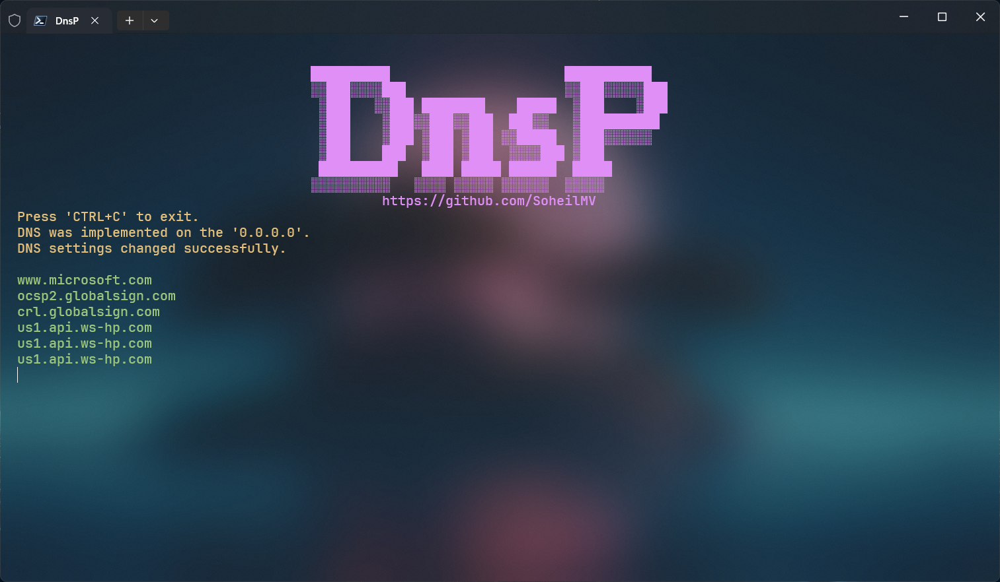

# DnsP
DNS Provider

# :inbox_tray:Installation
1. Download the program and unzip it . 
2. Add the program path to the system environment.
3. Open **CMD**.
4. Enter **dnsp** to make sure it works.

# :books:Commands
| Short Name | Long Name  | Description                        |
|------------|------------|------------------------------------|
| -a         | --add      | Add DNS to the list.               |
| -r         | --remove   | Remove DNS from the list.          |
| -b         | --block    | Add hosts to blacklist.            |
| -l         | --unblock  | Remove hosts from the blacklist.   |
| -s         | --skip     | Skip dns.                          |
| -k         | --unskip   | Undo skip dns.                     |
| -c         | --check    | Find healthy dns.                  |
| -p         | --protocol | Change the dns protocol.           |
| -m         | --mode     | Change the type of dns list usage. |
| -v         | --visit    | Visit the project repository.      |
|            | --log      | Display the list of DNS.           |
|            | --run      | Run local DNS.                     |
|            | --clear    | Clear all dns from the list.       |
|            | --help     | Display this help screen.          |
|            | --version  | Display version information.       |

# :computer:Using
> dnsp **[command]** **[value]**

### How to add dns?
> dnsp **[-a | --add] [DNS]**  
> dnsp **[-a | --add] [DNS] [-n | --name] [Name]**
>
> **Example:**  
> dnsp -a 1.1.1.1   
> dnsp -a 1.1.1.1 -n cloudflare

### How to remove dns?
> dnsp **[-r | --remove] [DNS or ID]**  
>
> **Example:**  
> dnsp -r 1.1.1.1

### How to block the host?
> dnsp **[-b | --block] [Host]**  
>
> **Example:**  
> dnsp -b google.com

### How to unblock the host?
> dnsp **[-l | --unblock] [Host]**  
>
> **Example:**  
> dnsp -l google.com

### How to deactivate dns?
> dnsp **[-s | --skip] [DNS or ID]**  
>
> **Example:**  
> dnsp -s 1.1.1.1

### How to activate dns?
> dnsp **[-k | --unskip] [DNS or ID]**  
>
> **Example:**  
> dnsp -k 1.1.1.1

### How to check dns list?
> dnsp **[-c | --check] [Link]**  
> dnsp **[-c | --check] [Link] [-t | --timeout] [Millisecond]**  
>
> **Example:**  
> dnsp -c https://www.example.com/  
> dnsp -c https://www.example.com/ -t 2000

*Note: By default the timeout is set to 5000ms*

### How to change the dns protocol?
> dnsp **[-p | --protocol]**

### How to change the type of dns list usage?
> dnsp **[-m | --mode]**

### How do I get a report?
> dnsp --log  

### How to start local dns?
> dnsp --run  

# :bookmark:Credits
- [Ae.Dns](https://github.com/alanedwardes/Ae.Dns) (Pure C# implementation of UDP, TCP and HTTPS ("DoH") DNS clients + servers with configurable caching/filtering layers)
- [CommandLineParser](https://github.com/commandlineparser/commandline) (The best C# command line parser that brings standardized *nix getopt style, for .NET. Includes F# support)
- [ConsoleTables](https://github.com/khalidabuhakmeh/ConsoleTables) (Print out a nicely formatted table in a console application C#)
- [Figgle](https://github.com/drewnoakes/figgle) (ASCII banner generation for .NET)
- [Newtonsoft.Json](https://github.com/JamesNK/Newtonsoft.Json) (Json.NET is a popular high-performance JSON framework for .NET)
- [QRCoder](https://github.com/codebude/QRCoder) (A pure C# Open Source QR Code implementation)