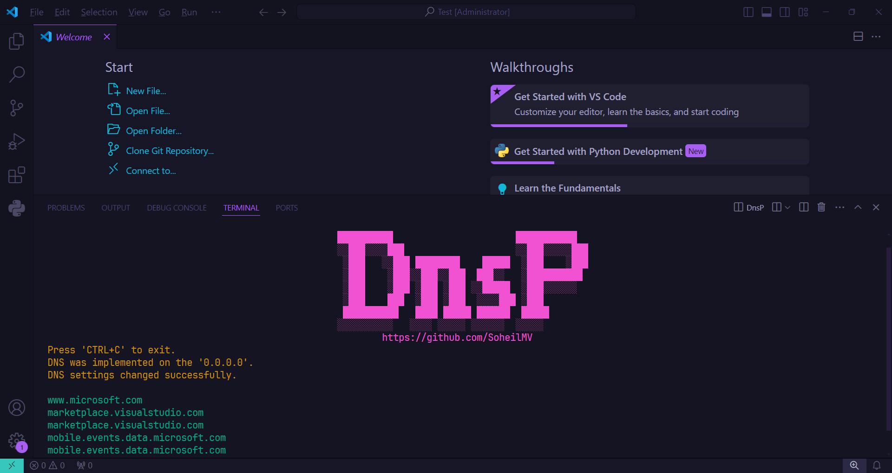

# DnsP
DnsP is a specialized DNS proxy server for Windows, similar to DNS Jumper but with enhanced capabilities. It transforms your computer (PC, laptop) or VPS into a custom DNS server, allowing you to leverage a curated list of public DNS providers while serving as a DNS endpoint for other devices.

# :inbox_tray:Installation
* Download the program and unzip the files. 
* Open CMD and navigate to the program's directory. 
* Now, run the program with the command `dnsp -e` or `dnsp --environment` to add it to the system environment. 
* Enjoy using the program.

# :books:Commands
| Short Name | Long Name     | Description                                 |
|------------|---------------|---------------------------------------------|
| -a         | --add         | Add dns to the list.                        |
| -r         | --remove      | Remove dns from the list.                   |
| -b         | --block       | Add host to blacklist.                      |
| -u         | --unblock     | Remove host from the blacklist.             |
| -c         | --check       | Find healthy dns.                           |
| -f         | --flush       | Flushing your previous dns addresses.       |
| -p         | --protocol    | Change the dns protocol.                    |
| -m         | --mode        | Change the type of dns list usage.          |
| -v         | --visit       | Visit the project repository.               |
| -e         | --environment | Checks if dnsp is added to the system path. |
| -l         | --log         | Display the list of dns.                    |
|            | --run         | Run local dns.                              |
|            | --help        | Display this help screen.                   |
|            | --version     | Display version information.                |

# :computer:Using
> dnsp **[command]** **[options]**

### How can i add a dns?
> dnsp **[-a | --add] [DNS]**  
> dnsp **[-a | --add] [DNS] [-n | --name] [Name]**    
> dnsp **[-a | --add] [File]**
>
> **Example:**  
> dnsp -a 1.1.1.1,1.0.0.1   
> dnsp -a 1.1.1.1,1.0.0.1 -n cloudflare    
> dnsp -a C:\example.csv    

### How can i remove a dns?
> dnsp **[-r | --remove] [DNS or ID or all]**  
>
>
> **Example:**  
> dnsp -r 1.1.1.1    
> dnsp -r all    

### How can i block a host to stop dns from accessing it?
> dnsp **[-b | --block] [Host]**  
>
> **Example:**  
> dnsp -b google.com

### How can i unblock a host to allow dns to access it?
> dnsp **[-u | --unblock] [Host]**  
>
> **Example:**  
> dnsp -u google.com

### How can i check the dns list?
> dnsp **[-c | --check] [Link]**  
> dnsp **[-c | --check] [Link] [-t | --timeout] [Millisecond]**  
>
> **Example:**  
> dnsp -c https://www.example.com/  
> dnsp -c https://www.example.com/ -t 2000

*Note: By default the timeout is set to 5000ms*

### How can i flush the dns cache?
> dnsp **[-f | --flush]**    

### How can i change the dns protocol type?
> dnsp **[-p | --protocol]**

### How can i change the dns usage mode?
> dnsp **[-m | --mode]**

### How can I check if dnsp is added to the system path?
> dnsp **[-e | --environment]**  

### How can I get the report?
> dnsp **[-l | --log]**  

### How can I start a local DNS server?
> dnsp --run **[DNS or ID]**  
>
> **Example:**  
> dnsp --run 1.1.1.1  
> dnsp --run 0

# :bookmark:Credits
- [Ae.Dns](https://github.com/alanedwardes/Ae.Dns) (Pure C# implementation of UDP, TCP and HTTPS ("DoH") DNS clients + servers with configurable caching/filtering layers)
- [CommandLineParser](https://github.com/commandlineparser/commandline) (The best C# command line parser that brings standardized *nix getopt style, for .NET. Includes F# support)
- [ConsoleTables](https://github.com/khalidabuhakmeh/ConsoleTables) (Print out a nicely formatted table in a console application C#)
- [Figgle](https://github.com/drewnoakes/figgle) (ASCII banner generation for .NET)
- [Newtonsoft.Json](https://github.com/JamesNK/Newtonsoft.Json) (Json.NET is a popular high-performance JSON framework for .NET)
- [QRCoder](https://github.com/codebude/QRCoder) (A pure C# Open Source QR Code implementation)
- [CsvHelper](https://github.com/JoshClose/CsvHelper) (Library to help reading and writing CSV files)